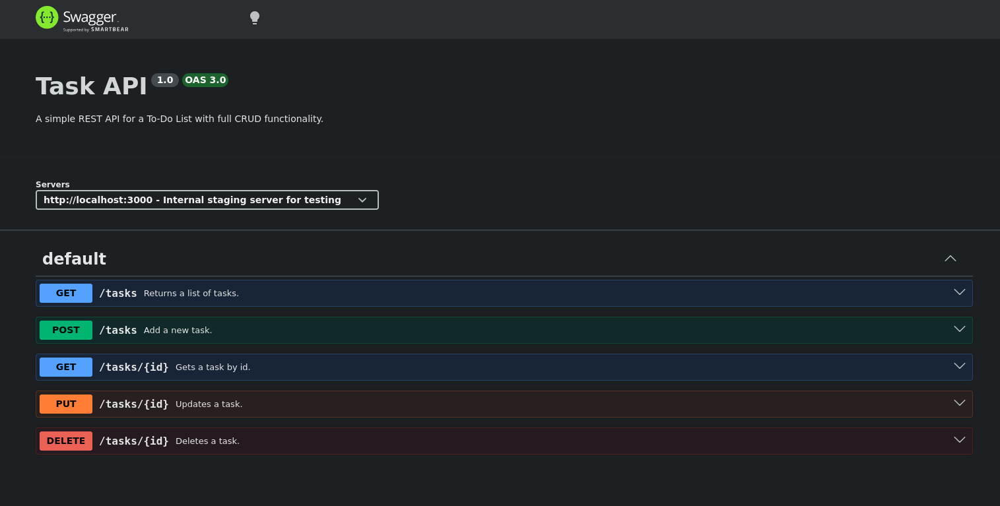

# Task API

A simple REST API for a To-Do List with full CRUD functionality.

The project is built with **JavaScript** and **Express.js** and includes **Swagger UI** for interactive API documentation.

## Features

- Full CRUD operations for tasks
- RESTful API
- Input validation
- OpenAPI 3.0 documentation
- Swagger UI interface

## Tech Stack

- JavaScript
- Node.js
- Express.js
- Swagger UI Express
- OpenAPI 3.0

## Getting Started

### Prerequisites

- Node.js (recommended version 18 or newer)
- npm

### Installation

Clone the repository:

```bash
git clone https://github.com/Yizuz02/task-api
cd task-api
```

Install the dependencies:

```bash
npm install
```

### Run the server

Start the server with:

```bash
node app.js
```

The server runs by default on:

```
http://localhost:3000
```

## API Endpoints

## API Endpoints

| Method | Endpoint | Description |
|--------|----------|-------------|
| GET | `/tasks` | Get all tasks. Supports filtering by `done` and searching by title using query parameters. |
| GET | `/tasks/{id}` | Get a specific task by ID. |
| POST | `/tasks` | Create a new task. |
| PUT | `/tasks/{id}` | Update an existing task title and/or completion status. |
| DELETE | `/tasks/{id}` | Delete a task by ID. |
| GET | `/stats` | Get calculated statistics about tasks. |
| POST | `/reset` | Restore the task list to the initial example data. |

## Swagger Documentation

Interactive API documentation is available at:

```
http://localhost:3000/docs
```

Swagger UI displays all available endpoints, request parameters, request bodies, response examples, and status codes. You can also test every endpoint directly from the browser.

**Swagger UI Preview**



## Internship

This project was developed as part of the **FlyRank AI Internship**.

## Extras

### Data Persistence

This API stores all tasks in memory (RAM). Because of that, every time the server is restarted, all created, updated, or deleted tasks are lost and the application returns to the initial three example tasks.

To keep data between server restarts, a persistent storage solution such as a database would be required.